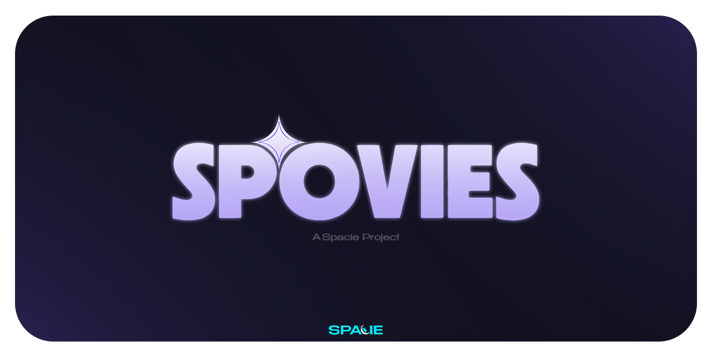

<p align="center">
  
</p>

<div align="center">

# Spovies

**Movie & TV discovery · Watchlist · Continue watching · Plugin-based streaming**

[](https://github.com/abdvlrqhman/Spovies-app)
[](https://github.com/abdvlrqhman/Spovies-app/releases)
[](https://flutter.dev)
[](LICENSE)

</div>

---

## Table of contents

- [Overview](#overview)
- [Features](#features)
- [Plugins](#plugins)
- [Creating your own plugin](#creating-your-own-plugin)
- [Data & backup](#data--backup)
- [Tech stack](#tech-stack)

---

## Overview

**Spovies** is a movie and TV show discovery app that brings everything into one place: browse, search, save to a watchlist, and watch via **plugin-based streaming**. All metadata—posters, cast, overviews, trailers—comes from **TMDB**.

<table>
<tr>
<td width="25%" align="center"><strong>Discover</strong></td>
<td width="25%" align="center"><strong>Watch</strong></td>
<td width="25%" align="center"><strong>Track</strong></td>
<td width="25%" align="center"><strong>Customize</strong></td>
</tr>
<tr>
<td>Trending & top-rated titles, search, genre filters.</td>
<td>In-app WebView player via installed plugins.</td>
<td>Watchlist & continue watching with progress.</td>
<td>Plugins, backup/restore, theme & playback settings.</td>
</tr>
</table>

> **Note:** Spovies does not host or stream content. Plugins supply watch links; the app is your single hub for discovery and organization.

---

## Features

### Home
| Feature | Description |
|--------|-------------|
| **Hero** | Spotlight for a trending movie. |
| **Trending & Top rated** | Horizontal rows of curated content. |
| **Continue watching** | Resumes from last position when the plugin supports progress. |

### Explore
| Feature | Description |
|--------|-------------|
| **Search** | By movie or TV show name. |
| **Movies / TV** | Toggle for trending content. |
| **Genre filters** | Narrow results. |
| **Details** | Tap any poster for full details. |

### Browse (Watchlist)
- Grid of saved titles.
- Remove items or clear the list.

### Details
- Backdrop, poster, title, genres, overview.
- **Cast** row · **Trailer** (opens in browser) · **Watch** (from plugins, in-app WebView).
- **TV shows** — Season and episode list.

### Player
- In-app **WebView** when you tap **Watch**.
- Plugins can report **progress** for continue-watching and history.
- Tuned for inline playback (e.g. on iOS).

### Profile (Settings)
| Option | Description |
|--------|-------------|
| **Manage plugins** | Add (by manifest URL), remove, view installed plugins. |
| **Export data** | Back up to a `.spovies` file (history, watchlist, plugins, settings). |
| **Import data** | Restore from a `.spovies` backup. |
| **Clear** | Watch history or watchlist. |
| **Theme** | Dark. |
| **Playback** | Player options. |
| **About** | App info and licenses. |

---

## Plugins

Plugins define:

- **Where** the Watch action appears (details screen, episode rows, etc.).
- **Which URL** (or URL template) opens in the in-app WebView.
- **Optional** progress reporting for Continue watching and watch history.

Install plugins in **Settings → Manage Plugins** by entering the **HTTPS URL** of a plugin manifest (JSON). Plugins can optionally send progress events via the Event Bridge.

---

## Creating your own plugin

Create a Spovies plugin by hosting a **manifest JSON file** over HTTPS and sharing its URL. Users add that URL in **Manage Plugins**; the app fetches, validates, and installs the plugin.

### 1. Manifest URL

- Must be **HTTPS**.
- The app sends a GET request and expects **JSON**.

### 2. Manifest schema

**Required fields:**

| Field | Type | Description |
|-------|------|-------------|
| `pluginId` | string | Unique ID (e.g. `my-streaming-plugin`). Cannot be empty. |
| `name` | string | Display name shown in the app. |
| `urlTemplate` | string | URL template with optional placeholders (see below). |

**Optional fields:**

| Field | Type | Default | Description |
|-------|------|---------|-------------|
| `version` | string | `"1.0.0"` | Plugin version. |
| `description` | string | `""` | Short description. |
| `iconUrl` | string | — | URL of an icon image. |
| `hooks` | string[] | `["media_header"]` | Where the plugin appears (see [Trigger hooks](#4-trigger-hooks)). |
| `actionType` | string | `"webview"` | `webview`, `externalLink`, or `metadataFetch`. |
| `presentationMode` | string | `"fullscreen"` | `fullscreen` or `popover`. |
| `eventBridgeConfig` | object | — | For progress reporting (see [Event Bridge](#6-event-bridge-progress--continue-watching)). |

### 3. URL template placeholders

| Placeholder | Replaced with |
|-------------|----------------|
| `{{tmdbId}}` | TMDB ID of the movie or show. |
| `{{type}}` | `movie` or `tv`. |
| `{{title}}` | URL-encoded title. |
| `{{imdbId}}` | IMDB ID if available, else empty. |
| `{{season}}` | Season number (for TV). |
| `{{episode}}` | Episode number (for TV). |

**TV path fallback:** If the template has no `{{season}}` or `{{episode}}` but the media is a TV show, the app appends `/season/episode` (e.g. `/1/1` for S1E1).

**Example:**

```json
{
  "pluginId": "example-stream",
  "name": "Example Stream",
  "version": "1.0.0",
  "description": "Watch movies and TV via Example.",
  "urlTemplate": "https://example.com/embed/{{type}}/{{tmdbId}}",
  "hooks": ["media_header", "episode_item"],
  "actionType": "webview",
  "presentationMode": "fullscreen"
}
```

- Movie: `https://example.com/embed/movie/12345`
- TV from header (no episode): `https://example.com/embed/tv/67890/1/1`
- TV episode: `https://example.com/embed/tv/67890/1/3`

### 4. Trigger hooks

| Hook value | Where it appears |
|------------|-------------------|
| `media_header` | Movie/TV details screen (main “Watch” area). |
| `episode_item` | Each episode row for TV shows. |
| `media_card_context` | Context menus or actions on media cards. |

### 5. Action types

| Value | Behavior |
|-------|----------|
| `webview` | Opens the resolved URL in the app’s WebView player. |
| `externalLink` | Opens the URL in the device browser or external app. |
| `metadataFetch` | Reserved for future use. |

### 6. Event Bridge (progress & continue watching)

If your streaming page runs inside the app’s WebView, you can send **progress events** so Spovies can update **Continue watching** and **watch history**.

Your page posts JSON messages that the app listens for (via an injected bridge).

**Expected postMessage format:**

```json
{
  "type": "PLAYER_EVENT",
  "data": {
    "event": "timeupdate",
    "currentTime": 120.5,
    "duration": 7200,
    "progress": 1.6,
    "id": "299534",
    "mediaType": "movie",
    "season": 1,
    "episode": 8
  }
}
```

| Field | Description |
|-------|-------------|
| `type` | Must be `"PLAYER_EVENT"`. |
| `data.event` | e.g. `timeupdate`, `play`, `pause`, `ended`, `seeked`. Critical events are saved immediately; `timeupdate` is throttled. |
| `data.currentTime` | Current playback time in seconds. |
| `data.duration` | Total duration in seconds. |
| `data.progress` | Progress percentage (0–100). |
| `data.id` | TMDB ID (string). |
| `data.mediaType` | `"movie"` or `"tv"`. |
| `data.season` / `data.episode` | Optional; for TV. |

**Manifest config for Event Bridge:**

```json
"eventBridgeConfig": {
  "postMessageOrigin": "*",
  "allowedEventTypes": ["progress", "pause", "stop", "heartbeat"]
}
```

- `postMessageOrigin` — Allowed origin (use `"*"` or your domain).
- `allowedEventTypes` — Optional allowlist.

Call `window.postMessage(…)` with the JSON above (e.g. from the player’s `timeupdate` or `pause` handlers).

### 7. Example manifests

**Minimal (required only):**

```json
{
  "pluginId": "my-plugin",
  "name": "My Plugin",
  "urlTemplate": "https://mysite.com/watch/{{type}}/{{tmdbId}}"
}
```

**Full (with Event Bridge):**

```json
{
  "pluginId": "my-plugin",
  "name": "My Plugin",
  "version": "1.0.0",
  "description": "Stream with progress tracking.",
  "iconUrl": "https://mysite.com/icon.png",
  "hooks": ["media_header", "episode_item"],
  "urlTemplate": "https://mysite.com/embed/{{type}}/{{tmdbId}}",
  "actionType": "webview",
  "presentationMode": "fullscreen",
  "eventBridgeConfig": {
    "postMessageOrigin": "*",
    "allowedEventTypes": ["progress", "pause", "stop", "heartbeat"]
  }
}
```

Host the JSON at an HTTPS URL and share it; users add it in **Settings → Manage Plugins**.

---

## Data & backup

| Capability | Description |
|------------|-------------|
| **Storage** | Watch history and watchlist are stored locally. |
| **Export** | Single `.spovies` file (history, watchlist, plugins, settings) for backup or transfer. |
| **Import** | Merge data from a `.spovies` file (e.g. after reinstall or on a new device). |

---

## Tech stack

| Layer | Technology |
|-------|------------|
| **App** | Flutter (Android & iOS) |
| **Metadata** | TMDB (images, cast, genres, etc.) |
| **State & routing** | Riverpod, GoRouter |
| **Local storage** | Hive (history, watchlist, plugins, settings) |
| **Player** | InAppWebView + Event Bridge for plugin progress |

---

<div align="center">

**Spovies** — Discovery, watchlist, and continue watching with plugin-based streaming.

© Spacie. All rights reserved.

<a href="https://spacie.net">
  
</a>

</div>
